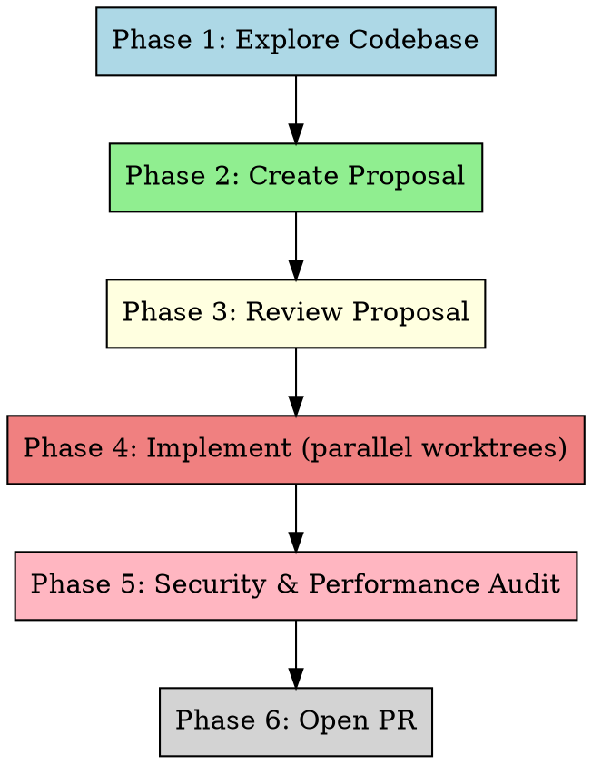

# Feature Dev

Orchestrate the complete feature development lifecycle using specialized subagents at each phase.

**Core principle:** Explore → Propose → Review → Implement → Audit → Ship

**Phases run sequentially; within a phase, subagents may run in parallel where independence allows.**

## When to Use

- Adding a new feature to an existing project
- Want full automation from exploration to PR
- Need structured OpenSpec-based workflow with security/performance gates

**When NOT to use:**
- Bug fixes (use `systematic-debugging` or `diagnosing-bugs`)
- Quick small changes (do it directly)
- Refactoring without new functionality (use `code-simplification`)

## Prerequisites

- `openspec` CLI available
- `gh` CLI authenticated
- Git repository with remote `origin`
- Skills loaded: `understand`, `openspec-ff-change`, `openspec-apply-change`, `using-git-worktrees`, `open-pr`, `owasp-security-review`, `performance-optimization`, `documentation-and-adrs`

## The Pipeline



## Phase 1 — Explore Codebase

**Goal:** Build deep understanding of the project before proposing anything.

### Tool selection

**If `codegraph` is available** (check with `which codegraph` or `command -v codegraph`), use it for graph-based codebase exploration — it provides dependency graphs, call chains, and impact analysis more efficiently than file scanning.

**Otherwise**, fall back to the `understand` skill which produces a knowledge graph via subagent analysis.

### Dispatch exploration subagent

**Path A — codegraph available:**

```
Task("explore-codebase", prompt="""
Use codegraph to analyze the project at {PROJECT_ROOT}.

1. Generate dependency graph: codegraph analyze --output /tmp/codegraph-{CHANGE_NAME}.json
2. If the project has a specific entry point or module related to {USER_DESCRIPTION}, run scoped analysis
3. Read the output graph and extract relevant subgraph for the feature area

Return a summary of:
1. Project structure (top-level and key directories)
2. Languages and frameworks used
3. Dependency graph for modules the feature will touch
4. Call chains and data flow relevant to the feature
5. Existing patterns and conventions to follow
6. Any constraints or conventions to follow
""", subagent_type="general")
```

**Path B — codegraph not available (fallback to understand):**

```
Task("explore-codebase", prompt="""
Use the understand skill to analyze the project at {PROJECT_ROOT}.

Produce a knowledge graph covering:
- Project architecture and layers
- Key modules and their responsibilities
- Existing patterns, conventions, and frameworks
- Entry points and data flow
- Testing infrastructure

Save results. Return a summary of:
1. Project structure (top-level and key directories)
2. Languages and frameworks used
3. Existing patterns relevant to the new feature
4. Areas of the codebase the feature will touch
5. Any constraints or conventions to follow
""", subagent_type="general")
```

### Collect results

After the subagent completes, read its output. Store:
- `$PROJECT_SUMMARY` — architecture overview
- `$TOUCH_AREAS` — files/directories the feature will likely affect
- `$CONSTRAINTS` — patterns and conventions to follow

## Phase 2 — Create OpenSpec Proposal

**Goal:** Generate a complete OpenSpec proposal with all artifacts.

### Dispatch proposal subagent

```
Task("create-proposal", prompt="""
Use the openspec-ff-change skill to create a complete OpenSpec proposal.

Project root: {PROJECT_ROOT}
Change name: {CHANGE_NAME}
Feature description: {USER_DESCRIPTION}

Context from codebase exploration:
{PROJECT_SUMMARY}

Areas to touch: {TOUCH_AREAS}
Constraints: {CONSTRAINTS}

Steps:
1. Run `openspec new change "{CHANGE_NAME}"` if not already done
2. Use openspec-ff-change workflow to create ALL artifacts (proposal, specs, design, tasks)
3. Ensure tasks are granular enough for parallel implementation
4. Each task should be independent where possible (for parallel worktree execution)

Return:
- Change name and artifact paths
- List of tasks created with brief descriptions
- Any decisions made during proposal creation
""", subagent_type="general")
```

### Collect results

After completion:
- Read all artifact files from the change directory
- Store `$ARTIFACT_PATHS` — paths to proposal, specs, design, tasks
- Store `$TASK_LIST` — extracted task descriptions

## Phase 3 — Review Proposal

**Goal:** Review the proposal for completeness, fill gaps, ensure quality.

### Dispatch review subagent(s)

Dispatch **at least one** subagent to review the proposal. For higher confidence, dispatch two reviewers in parallel — one focused on spec completeness, one on design/architecture alignment:

```
Task("review-spec-completeness", prompt="""
Review the OpenSpec proposal for the change "{CHANGE_NAME}" at {PROJECT_ROOT}.

Read ALL artifact files:
{ARTIFACT_PATHS}

Perform a completeness review:

1. **Artifact completeness:**
   - Are all required artifacts present?
   - Does the proposal cover the full feature scope?
   - Are specs detailed enough for implementation?
   - Are tasks granular and independent enough?

2. **Gap analysis:**
   - Missing edge cases?
   - Undefined error handling?
   - Missing acceptance criteria?
   - Gaps in the spec?

3. **Fix gaps directly:**
   - Edit artifact files to fill any gaps found
   - Add missing specs, edge cases, acceptance criteria
   - Ensure tasks are implementation-ready

Return:
- Summary of review findings
- List of gaps found and filled
- Confirmation that proposal is implementation-ready
""", subagent_type="general")

Task("review-design-alignment", prompt="""
Review the OpenSpec proposal design for alignment with the existing codebase.

Project root: {PROJECT_ROOT}
Read ALL artifact files: {ARTIFACT_PATHS}

Codebase context from exploration:
- Architecture: {PROJECT_SUMMARY}
- Patterns to follow: {CONSTRAINTS}

Review for:

1. **Design consistency:**
   - Does the proposed design follow existing architectural patterns?
   - Are new abstractions consistent with existing ones?
   - Does the data model align with existing schemas?

2. **Quality check:**
   - Are specs unambiguous?
   - Are tasks properly scoped (not too large)?
   - Are interfaces well-defined?
   - Are failure modes addressed?

3. **Fix issues directly:**
   - Adjust design artifacts to align with existing patterns
   - Refine specs for clarity
   - Rescope tasks if needed

Return:
- Summary of design alignment findings
- List of adjustments made
- Confirmation that proposal is coherent with the codebase
""", subagent_type="general")
```

**If only one reviewer is dispatched** (e.g., for small features), combine both concerns into a single subagent prompt.

### Collect results

After completion:
- Re-read the updated artifact files
- Confirm proposal is ready for implementation
- Store final `$TASK_LIST` (may have been updated by reviewer)

## Phase 4 — Implement with Parallel Worktrees

**Goal:** Implement all tasks using isolated git worktrees for parallel execution.

**CRITICAL:** Every implementation MUST run in a dedicated git worktree on a dedicated branch. Never implement directly on `main` or the current branch. This ensures clean isolation, easy rollback, and parallel-safe execution.

### Step 4a: Set up worktree infrastructure

Follow the `using-git-worktrees` skill to set up the worktree directory:

```bash
# Check existing worktree directories
ls -d .worktrees 2>/dev/null || ls -d worktrees 2>/dev/null

# Verify gitignore
git check-ignore -q .worktrees 2>/dev/null
```

If no worktree directory exists, create one and add to `.gitignore`:

```bash
mkdir -p .worktrees
echo ".worktrees/" >> .gitignore
git add .gitignore
git commit -m "chore: add worktrees to gitignore"
```

### Step 4b: Determine task grouping

Analyze `$TASK_LIST` for dependencies:
- **Independent tasks** → can run in parallel, each gets its own worktree
- **Dependent tasks** → must run sequentially, share a worktree or chain

Group tasks:
- `$PARALLEL_TASKS` — tasks with no inter-dependencies
- `$SEQUENTIAL_CHAINS` — ordered sequences of dependent tasks

### Step 4c: Dispatch parallel implementers

For each independent task (or sequential chain), create a worktree and dispatch an implementer subagent:

```
For each task in $PARALLEL_TASKS:

1. Create worktree:
   BRANCH_NAME="feature/{CHANGE_NAME}-{TASK_ID}"
   git worktree add ".worktrees/$BRANCH_NAME" -b "$BRANCH_NAME"

2. Dispatch implementer:
   Task("implement-{TASK_ID}", prompt="""
   Implement task: {TASK_DESCRIPTION}

   Worktree: {WORKTREE_PATH}
   Branch: {BRANCH_NAME}

   OpenSpec context:
   - Proposal: {PROPOSAL_CONTENT}
   - Specs: {SPECS_CONTENT}
   - Design: {DESIGN_CONTENT}
   - This task: {TASK_DETAIL}

   Instructions:
   1. cd to the worktree
   2. Run project setup (npm install / poetry install / etc.)
   3. Implement the task following the spec
   4. Write tests for the implementation
   5. Run tests to verify
   6. Mark task as done in the tasks file (- [ ] → - [x])
   7. Commit with descriptive message

   Constraints:
   - Follow existing code patterns from {CONSTRAINTS}
   - Only modify files relevant to this task
   - Do NOT modify other tasks' files
   - Run lint/typecheck if available

   Return: summary of changes, files modified, test results
   """, subagent_type="general")
```

**IMPORTANT:** Dispatch implementers in parallel using the Task tool. Do NOT wait for one to finish before starting the next.

### Step 4d: Handle sequential chains

For tasks that depend on each other, implement them sequentially within the same worktree:

```
For each chain in $SEQUENTIAL_CHAINS:

1. Create single worktree for the chain
2. Implement tasks in order, one at a time
3. Each task commits to the same branch
```

### Step 4e: Merge worktrees

After all implementations complete:

```bash
# Switch back to main branch
git checkout main

# Merge each feature branch
for BRANCH in feature/{CHANGE_NAME}-*; do
  git merge "$BRANCH" --no-ff -m "feat: merge {CHANGE_NAME} - {TASK_DESCRIPTION}"
done

# Clean up worktrees
for BRANCH in feature/{CHANGE_NAME}-*; do
  git worktree remove ".worktrees/$BRANCH" --force
done
```

If merge conflicts occur, resolve them before proceeding.

### Step 4f: Update project documentation

After all code is merged, update related project documentation to reflect the new feature. Dispatch a documentation subagent:

```
Task("update-docs", prompt="""
Update project documentation for the newly implemented feature "{CHANGE_NAME}".

Changed files (from git diff):
{CHANGED_FILES}

Context from implementation:
- What was built: {FEATURE_SUMMARY}
- Key design decisions: {DESIGN_DECISIONS}

Steps:
1. Identify documentation files that need updating:
   - README.md (if feature is user-facing)
   - API docs / OpenAPI specs (if endpoints changed)
   - Architecture docs (if new modules/patterns introduced)
   - CHANGELOG.md or similar
   - Inline code comments for complex logic
   - Examples or usage guides

2. For each relevant doc file:
   - Read the current content
   - Add or update sections related to the new feature
   - Ensure examples are accurate and runnable
   - Maintain existing doc style and conventions

3. If significant architectural decisions were made, consider:
   - Writing an ADR (Architecture Decision Record) using the documentation-and-adrs skill
   - Updating architecture diagrams if applicable

4. Commit documentation changes:
   git add <doc-files>
   git commit -m "docs: update documentation for {CHANGE_NAME}"

Return: list of documentation files updated, summary of changes made
""", subagent_type="general")
```

## Phase 5 — Security & Performance Audit

**Goal:** Review implemented code for security vulnerabilities and performance issues, then fix them.

### Step 5a: Collect changed files

```bash
git diff main --name-only --diff-filter=ACM
```

Store as `$CHANGED_FILES`.

### Step 5b: Dispatch parallel audit subagents

Dispatch security and performance reviewers in parallel:

```
Task("security-audit", prompt="""
Perform an OWASP security review on the newly implemented feature.

Changed files:
{CHANGED_FILES}

Use the owasp-security-review skill methodology:
1. Read each changed file
2. Check for OWASP Top 10 2025 vulnerabilities
3. Check for API security issues if applicable
4. Check for LLM security issues if applicable
5. Run dependency audit if possible (npm audit / pip-audit)

For each finding:
- Severity: Critical / High / Medium / Low
- Location: file:line
- Description and exploitation scenario
- Fix: concrete code change

After identifying issues, FIX THEM directly in the code.

Return: list of findings, fixes applied, confirmation all issues resolved
""", subagent_type="general")

Task("performance-audit", prompt="""
Review the newly implemented feature for performance issues.

Changed files:
{CHANGED_FILES}

Use the performance-optimization skill methodology:
1. Read each changed file
2. Check for N+1 queries
3. Check for unbounded data fetching
4. Check for missing caching opportunities
5. Check for bundle size impacts (frontend)
6. Check for memory leaks or unbounded growth
7. Check for missing pagination

For each issue found:
- Impact: high / medium / low
- Location: file:line
- Description
- Fix: concrete code change

After identifying issues, FIX THEM directly in the code.

Return: list of findings, fixes applied, confirmation all issues resolved
""", subagent_type="general")
```

### Step 5c: Collect audit results and verify

After both subagents complete:
1. Read their summaries
2. Check for any conflicts between security and performance fixes
3. Run the test suite to ensure fixes don't break anything:

```bash
# Run from project root
npm test 2>/dev/null || pytest 2>/dev/null || cargo test 2>/dev/null || go test ./... 2>/dev/null
```

4. If tests fail, dispatch a fix subagent to resolve

### Step 5d: Commit audit fixes

```bash
git add -A
git commit -m "fix: address security and performance audit findings"
```

## Phase 6 — Open PR

**Goal:** Create a well-documented Pull Request with full `open-pr` workflow.

### Dispatch PR subagent

```
Task("open-pr", prompt="""
Use the open-pr skill to create a Pull Request for the feature "{CHANGE_NAME}".

Project root: {PROJECT_ROOT}

Follow the open-pr skill exactly. Here is the full workflow:

## 前置檢查

1. cd to {PROJECT_ROOT} first
2. Confirm in Git repo and `gh` is available: `gh auth status`
3. Confirm current branch is NOT main/master
4. Confirm there are changes to commit
5. Confirm remote origin exists: `git remote get-url origin`
6. Push current branch: `git push -u origin "$(git branch --show-current)"

## 語言規範（強制）

PR 標題與內文都必須使用臺灣繁體中文，避免中國常見用語：
- 拉取請求 -> Pull Request
- 默認 -> 預設
- 配置 -> 設定
- 資源庫 -> 儲存庫
- 用戶 -> 使用者
- 視圖 -> 檢視
- 代碼 -> 程式碼
- 運行 -> 執行
- 優化 -> 最佳化

## 產生 PR 內文

```bash
cd {PROJECT_ROOT}
export BASE_BRANCH="$(gh repo view --json defaultBranchRef --jq '.defaultBranchRef.name')"
export CURRENT_BRANCH="$(git branch --show-current)"
{AGENT_SKILLS_ROOT}/open-pr/scripts/build_pr_body.sh generate
```

## 驗證 PR 內文

```bash
{AGENT_SKILLS_ROOT}/open-pr/scripts/build_pr_body.sh validate
```

## 發起 PR

```bash
gh pr create \
  --base "${BASE_BRANCH}" \
  --head "${CURRENT_BRANCH}" \
  --title "feat: {FEATURE_DESCRIPTION_IN_CHINESE}" \
  --body-file /tmp/pr_body.md
```

## 自動追蹤（強制）

PR 建立成功後，立即執行 review-pr-3x：
```bash
PR_NUMBER="$(gh pr view --json number --jq .number)"
review-pr-3x "${PR_NUMBER}"
```

## 輸出回報

回報以下資訊：
1. PR 標題與連結
2. PR message 重點摘要
3. review-pr-3x 三輪結果（新評論、CI 狀態、新增提交）
4. 仍待處理事項（若有）

Return: PR URL, review status summary, any remaining items
""", subagent_type="general")
```

### Collect results

After completion, report to user:
- PR URL and title
- Summary of all changes made
- Security/performance audit results
- `review-pr-3x` tracking results
- Any remaining items or follow-ups

## Quick Reference

| Phase | Subagent(s) | Skill Used | Parallel? |
|-------|-------------|------------|-----------|
| 1. Explore | 1 | `codegraph` or `understand` | No |
| 2. Proposal | 1 | `openspec-ff-change` | No |
| 3. Review | 1-2 | (review subagents) | Yes |
| 4. Implement | N | `openspec-apply-change` + `using-git-worktrees` | Yes |
| 4f. Update Docs | 1 | `documentation-and-adrs` | No |
| 5. Audit | 2 | `owasp-security-review` + `performance-optimization` | Yes |
| 6. PR | 1 | `open-pr` | No |

## Error Handling

- **Subagent failure:** Retry once with additional context about the failure
- **Merge conflicts:** Pause and ask user for resolution guidance
- **Audit finds critical issues:** Fix before proceeding to PR
- **Tests fail after audit fixes:** Dispatch fix subagent, re-run tests
- **PR creation fails:** Check `gh auth status`, report blocker

**NEVER:**
- Skip the exploration phase (leads to bad proposals)
- Skip proposal review (leads to implementation gaps)
- Implement without worktrees (causes merge conflicts)
- Implement on `main` directly — always use dedicated worktree + branch
- Skip security/performance audit (ships vulnerabilities)
- Skip documentation updates (future contributors lose context)
- Create PR without tests passing

## Red Flags

- Proposal created without codebase exploration context
- Tasks too large for single worktree implementation
- No tests written during implementation
- Implementation done on `main` instead of a dedicated branch/worktree
- Security reviewer and performance reviewer conflict on same code
- Merge conflicts during worktree consolidation
- Documentation not updated after feature merge
- PR created with failing CI
